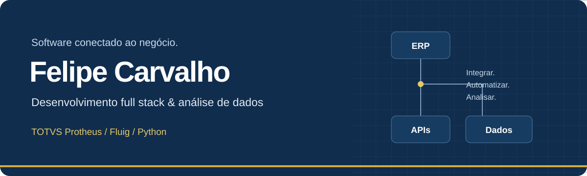

  

  <a href="https://lipestile.github.io"><strong>Conheça meu portfólio</strong></a>
  &nbsp;&nbsp;|&nbsp;&nbsp;
  <a href="https://www.linkedin.com/in/felipe-carvalho-balbino-da-silva-092241272/">Conecte-se no LinkedIn</a>
  &nbsp;&nbsp;|&nbsp;&nbsp;
  <a href="https://github.com/lipestile?tab=repositories">Explore meus repositórios</a>

Brasília, DF · Disponível para projetos

## Olá, sou o Felipe

Desenvolvo integrações para conectar **sistemas corporativos, processos e dados**. Meu foco está no ecossistema **TOTVS Protheus e Fluig**, com Python para automação e análise de dados.

Curso **Análise e Desenvolvimento de Sistemas no IESB** e **Engenharia de Software na Anhanguera**. Busco construir soluções com arquitetura clara, APIs bem definidas e código fácil de manter.

## Onde concentro meu trabalho

| Especialidade | Foco |
| :--- | :--- |
| **ERP e processos** | Protheus, desenvolvimento em ADVPL e TL++, fluxos de aprovação e integração de processos no Fluig. |
| **Dados e automação** | Pipelines ETL com Python, análise com Pandas e NumPy e consultas em SQL Server e Oracle. |
| **Aplicações e APIs** | Integrações REST e interfaces com JavaScript, TypeScript, Node.js e PO-UI. |
| **Qualidade e entrega** | Versionamento com Git, automação com GitHub Actions e ambientes com Docker. |

## Tecnologias

**TOTVS**  
Protheus · Fluig BPM/ECM · ADVPL · TL++ · PO-UI

**Dados**  
Python · Pandas · NumPy · SQL Server · Oracle · ETL

**Web**  
JavaScript · TypeScript · Node.js · APIs REST · Tailwind CSS

**Ferramentas**  
Git · GitHub Actions · Docker · VS Code / TDS · Postman

<strong>O que estou aprofundando</strong>

- Orientação a objetos com TL++.
- Fluxos de aprovação dinâmicos com Fluig e BPMN.
- Integração de APIs REST e desenvolvimento de interfaces com PO-UI.
- Automação de integração e entrega contínua com GitHub Actions.

## Explore meu trabalho

No portfólio, apresento cases de integração ERP, pipelines de dados e um terminal de desenvolvedor interativo.

**[Abrir portfólio](https://lipestile.github.io)** · **[Ver repositórios](https://github.com/lipestile?tab=repositories)**

Para conversar sobre projetos, entre em contato pelo **[LinkedIn](https://www.linkedin.com/in/felipe-carvalho-balbino-da-silva-092241272/)**.

---

  Felipe Carvalho · Brasília, Brasil 
  “May the Source be with you.”

