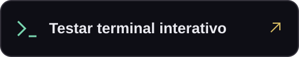

  

  
  &nbsp;
  

 

### Do ERP ao insight.

Desenvolvo integrações no ecossistema **TOTVS Protheus e Fluig**, conectando processos corporativos a interfaces web e automações com **Python**. Meu foco: arquitetura clara, APIs bem definidas e soluções fáceis de manter.

 

### Código em prática

**[EvidencIA](https://github.com/evidencia-grupo/EvidencIA)**  
Projeto em equipe: extensão para checagem factual de vídeos do YouTube com inteligência artificial.  
TypeScript · Python · IA · Extensão de navegador

**[Nano-Chalange](https://github.com/lipestile/Nano-Chalange)**  
Atividade e desafios desenvolvidos em Python.  
Python · Desenvolvimento em equipe

**[Explore meus repositórios](https://github.com/lipestile?tab=repositories)** · **[Conheça os cases do portfólio](https://lipestile.github.io/#solucoes)**

 

<strong>Stack técnica</strong>

 

**ERP & processos**  
TOTVS Protheus · Fluig BPM/ECM · ADVPL · TL++ · PO-UI

**Dados & automação**  
Python · Pandas · NumPy · SQL Server · Oracle · ETL

**Web & integrações**  
JavaScript · TypeScript · Node.js · APIs REST · Tailwind CSS

**Desenvolvimento & entrega**  
Git · GitHub Actions · Docker · VS Code / TDS · Postman

<strong>Formação & estudos atuais</strong>

 

Curso **Análise e Desenvolvimento de Sistemas no IESB** e **Engenharia de Software na Anhanguera**.

Estou aprofundando orientação a objetos com TL++, fluxos dinâmicos no Fluig, interfaces com PO-UI e integração contínua com GitHub Actions.

 

“May the Source be with you.”

